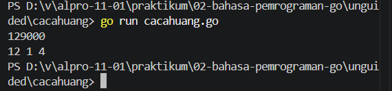

# <h1 align="center">Laporan Praktikum Modul 2 - Variabel, Tipe Data, dan Operasi</h1>

Varel Dwi Putra - 109092600024

## Dasar Teori

### A. Bahasa Pemrograman Go
Bahasa Go (atau Golang) adalah bahasa pemrograman yang efisien dan dikembangkan oleh Google. Go diimplementasikan sebagai kompilator (compiler), di mana kode program akan diperiksa lalu diubah menjadi program eksekutabel (.exe) sebelum dijalankan. Hal ini membuat program dapat berjalan dengan cepat dan efisien.

### B. Package dan Struktur Program di Go

#### 1. Pengertian Package main dan func main()
Dalam bahasa Go, setiap program memiliki package. Package utama adalah `package main` yang menandakan bahwa program dapat dijalankan. Di dalamnya terdapat `func main()` yang merupakan titik awal eksekusi program. Untuk input dan output digunakan package `fmt`, seperti `fmt.Scan` untuk input dan `fmt.Println` untuk output.

#### 2. Tipe Data dan Deklarasi Variabel di Go
Variabel adalah tempat untuk menyimpan data di dalam memori. Beberapa tipe data dasar dalam Go antara lain:
- `int`: digunakan untuk bilangan bulat (hasil pembagian tidak menyertakan desimal)
- `float64`: digunakan untuk bilangan desimal
- `string`: digunakan untuk teks
- `bool`: digunakan untuk nilai logika (true atau false)

## Guided

### 1. Tukar.go

package main

import "fmt"

func main() {
	var a, b int

	//Membaca Input
	fmt.Scan(&a)
	fmt.Scan(&b)

	//Menukar a dan b
	a, b = b, a

	//Output
	fmt.Println(a)
	fmt.Println(b)
}

#### Deskripsi
Program ini digunakan untuk menukar dua bilangan. Program membaca nilai a dan b, lalu menukarnya sehingga nilai a menjadi b dan b menjadi a. Setelah itu hasil ditampilkan ke layar.

### 2. Skor.go

package main

import "fmt"

func main() {
	var nama string
	var skorMatematika, skorBahasaInggris int

	//Membaca Input
	fmt.Scan(&nama)
	fmt.Scan(&skorMatematika)
	fmt.Scan(&skorBahasaInggris)

	//Menghitung total & rata-rata
	total := skorMatematika + skorBahasaInggris
	rataRata := total / 2

	//Menampilkan Output
	fmt.Println(nama)
	fmt.Println(total)
	fmt.Println(rataRata)

}

#### Deskripsi
Program ini digunakan untuk menghitung total dan rata-rata dari dua nilai. Program membaca nama dan dua nilai, lalu menghitung total dan rata-rata, kemudian menampilkan hasilnya.

### 3. Suhu.go

package main

import "fmt"

func main() {
	var reamur float64
	var fahrenheit float64
	var kelvin float64
	var celsius float64

	fmt.Scan(&celsius)

	reamur = celsius * 4.0 / 5.0
	fahrenheit = celsius*9.0/5.0 + 32.0
	kelvin = celsius + 273.15

	fmt.Println(reamur, fahrenheit, kelvin)

}

#### Deskripsi
Program ini membaca suhu dalam Celsius, lalu mengubahnya ke Reamur, Fahrenheit, dan Kelvin menggunakan rumus yang ada. Hasilnya ditampilkan ke layar sebagai output.

### 4. Lingkaran.go

package main

import "fmt"

func main() {
	var pi float64 = 3.14
	var r float64
	var luas float64

	fmt.Scan(&r)

	luas = pi * r * r

	fmt.Println(luas)

}

#### Deskripsi
Program ini membaca nilai jari-jari lingkaran, lalu menghitung luasnya menggunakan rumus π × r × r. Hasilnya ditampilkan ke layar.

## Unguided

### 1. Cacahuang.go

package main

import "fmt"

func main() {
	var uang int
	fmt.Scan(&uang)

	puluh := uang / 10000
	sisa := uang % 10000

	lima := sisa / 5000
	sisa = sisa % 5000

	seribu := sisa / 1000

	fmt.Println(puluh, lima, seribu)
}

##### Output

#### Deskripsi
Program ini digunakan untuk menghitung jumlah lembar uang berdasarkan pecahan 10000, 5000, dan 1000 dari suatu input uang. Program membaca input, lalu menggunakan operasi pembagian dan sisa hasil bagi untuk menentukan jumlah masing-masing pecahan. Hasil ditampilkan ke layar.

### 2. Kalkulator.go
package main

import "fmt"

func main() {
	var a int
	var b int

	fmt.Scan(&a)
	fmt.Scan(&b)

	fmt.Println(a + b)
	fmt.Println(a - b)
	fmt.Println(a / b)
	fmt.Println(a * b)
	fmt.Println(a % b)
}

##### Output
[Screenshot Output Unguided](unguided/kalkulator/kalkulator.go)

#### Deskripsi
Program ini membaca dua bilangan bulat dari input, lalu menghitung hasil penjumlahan, pengurangan, perkalian, pembagian, dan sisa bagi. Setiap hasil ditampilkan ke layar sebagai output sesuai dengan perintah soal.

## Kesimpulan
Praktikum ini bertujuan untuk memahami dasar-dasar pemrograman menggunakan bahasa Go, seperti penggunaan variabel, input-output, serta operasi aritmatika. Pada bagian guided, dilakukan latihan dasar seperti menukar nilai variabel dan menghitung nilai sederhana. Sedangkan pada bagian unguided, dibuat beberapa program seperti konversi pecahan uang, kalkulator sederhana, perhitungan luas lingkaran, dan konversi suhu. Dari praktikum ini dapat disimpulkan bahwa bahasa Go memiliki sintaks yang sederhana dan mudah dipahami, sehingga cocok digunakan untuk pemula dalam mempelajari konsep dasar pemrograman.

## Referensi
1. Golang Official. (2024). Tour of Go. Diakses dari: https://go.dev/tour/⁠�