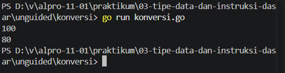
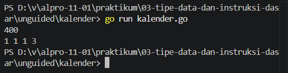

# <h1 align="center">Laporan Praktikum Modul [3] - [Tipe Data Dan Instruksi Dasar]</h1>

[Varel Dwi Putra] - [109092600024]

## Dasar Teori

### A. Variabel dan Deklarasi dalam Bahasa Pemrograman Go
Variabel adalah lokasi penyimpanan di memori yang diberi nama dan digunakan untuk menyimpan data yang nilainya dapat berubah selama eksekusi program. Pada bahasa pemrograman Go (Golang), setiap variabel wajib memiliki tipe data yang jelas (strongly typed). Deklarasi variabel di Go dapat dilakukan secara eksplisit menggunakan kata kunci var diikuti oleh nama variabel dan tipe datanya (misal: var celsius float64), atau secara implisit menggunakan operator short declaration := yang secara otomatis menentukan tipe data berdasarkan nilai yang diinisialisasikan.

### B. Operator dan Tipe Data dalam Go

#### 1. Tipe Data Dasar dan Konversi
Golang menyediakan berbagai tipe data dasar, seperti bilangan bulat (int), bilangan riil (float64), dan string (string). Tipe data float64 digunakan untuk mengolah nilai pecahan seperti perhitungan suhu, sedangkan int digunakan untuk perhitungan kuantitas bulat seperti jumlah lembar uang kembalian atau perhitungan kalender. Setiap tipe data menentukan jenis operasi yang dapat dilakukan terhadap variabel tersebut.

#### 2. Operator Aritmatika dan Manipulasi Nilai
Operator aritmatika di Go mencakup penjumlahan (+), pengurangan (-), perkalian (*), pembagian (/), dan sisa bagi atau modulo (%).
 * Pembagian Bilangan Bulat (/): Menghasilkan bagian bulat dari hasil bagi dua bilangan tanpa menyertakan sisa desimalnya, contohnya 400 / 360 menghasilkan 1.
 * Operator Modulo (%): Menghasilkan sisa dari hasil pembagian dua bilangan bulat. Kombinasi pembagian dan modulo sering digunakan untuk memecah satuan angka, seperti memisahkan pecahan uang kembalian atau mengonversi total hari.
 * Multiple Assignment: Go mendukung pengisian dan pertukaran nilai beberapa variabel secara bersamaan dalam satu baris instruksi (contoh: x, y, z = z, x, y).

<!-- Tambahkan poin A, B, C, ... atau sub-topik 1, 2, 3, ... sesuai kebutuhan modul -->

## Guided

### 1. Kasir

package main

import "fmt"

func main() {
	var x int

	fmt.Println("Masukan Nominal: ")
	fmt.Scan(&x)

	var sepuluhRibuan int = x / 10000
	var sisa int = x % 10000

	var limaRibuan int = sisa / 5000
	sisa = sisa % 5000

	var seribuan int = sisa / 1000

	fmt.Println(sepuluhRibuan, limaRibuan, seribuan)
}

#### Deskripsi
 Program ini dibuat untuk menghitung berapa lembar masing-masing uang sepuluh ribuan, lima ribuan, dan seribuan yang harus diserahkan kasir. 

### 2. Konversi

package main

import "fmt"

func main() {
	var celcius float64

	fmt.Print("masukan suhu: ")
	fmt.Scanln(&celcius)

	fmt.Println(celcius + 273)
}

#### Deskripsi
 Program ini dibuat untuk mengonversi suhu dari derajat Celsius menjadi Kelvin. 

### 3. Tukar

package main

import "fmt"

func main() {
	var x, y, z int
	fmt.Scan(&x, &y, &z)

	temp := x
	x = z
	z = y
	y = temp

	fmt.Println(x, y, z)
}

#### Deskripsi
 Program ini dibuat untuk mempertukarkan nilai bilangan bulat x, y, dan z dengan ketentuan nilai y berisi x, nilai x berisi z, dan y berisi nilai y.

## Unguided

### 1. Konversi

package main

import "fmt"

func main() {
	var x, y, z int
	fmt.Scan(&x, &y, &z)

	temp := x
	x = z
	z = y
	y = temp

	fmt.Println(x, y, z)
}

##### Output

#### Deskripsi
 Program ini dibuat untuk mengonversi suhu dari derajat Celsius menjadi derajat Reamur. 

### 2. Kalender

package main

import "fmt"

func main() {
	var tahun, bulan, minggu, hari, sisa int
	fmt.Scan(&hari)

	tahun = hari / 360
	sisa = hari % 360
	bulan = sisa / 30
	sisa = sisa % 30
	minggu = sisa / 7
	hari = sisa % 7

	fmt.Println(tahun, bulan, minggu, hari)
}

##### Output

#### Deskripsi
Program ini dapat mengonversi jumlah hari ke dalam satuan tahun, bulan, minggu, dan hari, mengikuti aturan yang mendekati waktu di dunia nyata. Program menerima sebuah bilangan bulat yang menyatakan jumlah hari, kemudian mengonversinya ke dalam empat bilangan bulat yang menyatakan tahun, bulan, minggu, dan sisa hari. 

## Kesimpulan
Berdasarkan hasil praktikum pada Modul 03 "Variabel dan Operator" menggunakan bahasa pemrograman Go, dapat disimpulkan bahwa penggunaan tipe data yang tepat sangat krusial, seperti penggunaan float64 untuk perhitungan presisi desimal pada konversi suhu serta int untuk nilai bulat pada pemrosesan pecahan uang dan penanggalan. Selain itu, pemanfaatan operator aritmatika pembagian bulat (/) dan modulo (%) terbukti efektif untuk memecah kombinasi nilai ke dalam satuan terkecil secara logis. Bahasa Go juga memberikan efisiensi penulisan kode melalui fitur multiple assignment yang mempermudah proses pertukaran nilai variabel secara langsung tanpa membutuhkan variabel penampung tambahan.

## Referensi
1. Go. (2023). A Tour of Go: Variables and Basic Types. https://go.dev/tour/basics/4
