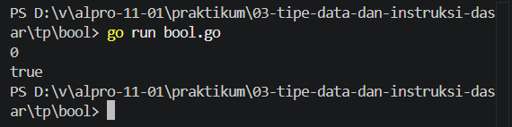
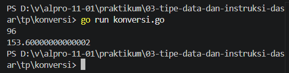

# <h1 align="center">Tugas Pendahuluan Modul [3] - [Judul Modul/Topik]</h1>

[Varel Dwi Putra] - [109092600024]

### 1. Sisa Kue

package main

import "fmt"

func main() {
	var x int
	var y int

	fmt.Scan(&x)
	fmt.Scan(&y)

	sisa := x % y

	fmt.Println(sisa)
}

##### Output
![!\[Screenshot Output Unguided\]](tp/sisaKue/output.png)

#### Deskripsi
Program ini dibuat untuk menghitung berapa banyak kue yang tersisa setelah kue dibagikan secara sama rata kepada setiap anggota keluarga. 

### 2. Boolean

package main

import "fmt"

func main() {
	var x int

	fmt.Scan(&x)

	fmt.Println(x == 0)
}

##### Output

#### Deskripsi
Program ini dibuat untuk membaca dan mencetak nilai bertipe bool yaitu true dan false. 

### 3. Konversi

package main

import "fmt"

func main() {
	var mil float64 = 1.6
	var x float64

	fmt.Scan(&x)

	killometer := x * mil

	fmt.Println(killometer)
}

##### Output

#### Deskripsi
Program ini dibuat untuk mengonversi mil ke kilometer. Program ini membaca nilai dalam mil yang berupa bilangan desimal dari input pengguna lalu mengonversinya ke kilometer, lalu menampilkan hasilnya. 

## Kesimpulan
praktikum ini menunjukkan penggunaan operator modulo (%) yang efektif untuk menghitung sisa pembagian bulat pada kasus pembagian kue keluarga, penerapan tipe data bool untuk memproses input dan output nilai logika secara langsung, serta penggunaan tipe data float64 beserta pemformatan fmt.Printf("%.1f") untuk mengolah dan menampilkan hasil konversi mil ke kilometer dengan presisi satu angka di belakang koma.