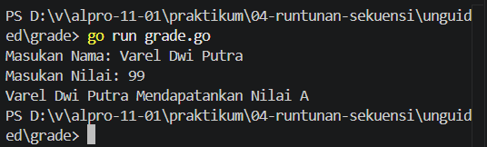
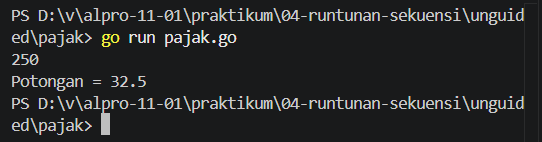

# <h1 align="center">Laporan Praktikum Modul [4] - [Runtunan/Sekuensi]</h1>

[Varel Dwi Putra] - [109092600024]

## Dasar Teori

### A. Bahasa Pemrograman Go dan Sekuensi
Bahasa Go (Golang) merupakan bahasa pemrograman bertipe terstruktur yang mengeksekusi perintah secara runtut (sequence) dari atas ke bawah. Sekuensi adalah struktur paling dasar dalam algoritma di mana setiap instruksi dijalankan tepat satu kali secara berurutan sesuai urutan penulisannya.

### ​B. Struktur Kontrol Percabangan di Go

#### ​1. Percabangan if-else
Percabangan if-else digunakan untuk mengevaluasi suatu kondisi boolean. Jika kondisi bernilai true, blok kode di dalam if akan dieksekusi. Untuk banyak kondisi, percabangan dapat disambung menggunakan else if atau dibuat bersarang (nested if).  

#### ​2. Percabangan switch-case
Pernyataan switch menyediakan cara yang lebih bersih untuk melakukan percabangan multi-kondisi. Pada Go, switch dapat ditulis tanpa ekspresi (kondisi dimasukkan langsung pada setiap case) untuk menggantikan struktur if-else yang panjang.

## Guided

### 1. Grade,go

import (
	"bufio"
	"fmt"
	"os"
)

func main() {
	var nama string
	var nilai float64
	var grade string

	scanner := bufio.NewScanner(os.Stdin)
	scanner.Scan()

	nama = scanner.Text()

	fmt.Scan(&nilai)

	if nilai >= 90 && nilai <= 100 {
		grade = "A"
	} else if nilai >= 80 && nilai < 90 {
		grade = "B"
	} else if nilai >= 70 && nilai < 80 {
		grade = "C"
	} else if nilai >= 60 && nilai < 70 {
		grade = "D"
	} else {
		grade = "F"
	}

	fmt.Printf("%s mendapatkan nilai %s\n", nama, grade)
}

#### Deskripsi
Program  yang menerima input berupa nama dan nilai (dalam bentuk angka) dari seorang siswa. 

### 2. Klasisfikasi.go

package main

import (
	"fmt" // Hanya memerlukan fmt untuk keperluan input dan output
)

func main() {
	// Pendefinisian variabel secara eksplisit beserta tipe datanya
	var usia int
	var gaji int
	var keterangan string

	// Membaca dua masukan berupa angka dari pengguna (usia dan gaji)
	// fmt.Scan otomatis memisahkan input berdasarkan spasi atau baris baru (enter)
	fmt.Scan(&usia)
	fmt.Scan(&gaji)

	// Menggunakan switch tanpa ekspresi.
	// Cara kerjanya sama persis seperti deretan if - else if.
	// Program akan mengecek dari atas ke bawah, dan menjalankan case pertama yang bernilai benar (true).
	switch {
	case usia < 18:
		keterangan = "Masih sekolah"
	case usia >= 18 && usia <= 25 && gaji >= 50:
		keterangan = "Muda sukses"
	case usia >= 18 && usia <= 25 && gaji < 50:
		keterangan = "Masih belajar hidup"
	case usia >= 26 && usia <= 40 && gaji >= 100:
		keterangan = "Pekerja mapan"
	case usia >= 26 && usia <= 40 && gaji < 100:
		keterangan = "Perlu perbaikan karier"
	case usia > 40 && gaji >= 150:
		keterangan = "Profesional berpengalaman"
	case usia > 40 && gaji < 150:
		keterangan = "Perlu evaluasi finansial"
	}

#### Deskripsi
Program yang menampilkan menu pilihan untuk sistem penilaian siswa atau keluar dari program.

### 3. Penilaian.go

package main

import (
	"bufio" // Digunakan untuk membaca masukan string yang memiliki spasi (seperti nama lengkap)
	"fmt"
	"os" // Menyediakan akses ke sistem operasi, dalam hal ini os.Stdin yang merepresentasikan keyboard
)

func main() {
	// Pendefinisian variabel secara eksplisit beserta tipe datanya
	var pilihan int
	var nama string
	var nilai float64
	var grade string

	// Menampilkan cetakan Menu ke layar
	fmt.Println("============= Menu =============")
	fmt.Println("1. Sistem penilaian")
	fmt.Println("0. Keluar")
	fmt.Print("Pilih opsi: ")

	// Membaca masukan pilihan (angka).
	// Kita menggunakan Scanln agar saat user menekan 'Enter', karakter enter tersebut
	// ikut diolah/dibersihkan dan tidak melompat (mengganggu) masukan nama di bawahnya.
	fmt.Scanln(&pilihan)

	// Percabangan/Sekuensi bersyarat berdasarkan input pengguna
	if pilihan == 1 {
		fmt.Print("Masukkan nama siswa: ")

		// Membuat alat pembaca (scanner) baru yang mengambil masukan dari keyboard
		scanner := bufio.NewScanner(os.Stdin)

		// Proses membaca masukan dari pengguna sampai tombol Enter ditekan
		scanner.Scan()

		// Mengambil teks (nama) yang baru saja dibaca dan menyimpannya ke variabel
		nama = scanner.Text()

		fmt.Print("Masukkan nilai siswa: ")
		fmt.Scanln(&nilai)

		// Menentukan grade nilai
		if nilai >= 90 && nilai <= 100 {
			grade = "A"
		} else if nilai >= 80 && nilai < 90 {
			grade = "B"
		} else if nilai >= 70 && nilai < 80 {
			grade = "C"
		} else if nilai >= 60 && nilai < 70 {
			grade = "D"
		} else {
			grade = "F"
		}

		// %s adalah format (placeholder) untuk mencetak data bertipe string
		// %s pertama akan digantikan oleh isi variabel 'nama', %s kedua oleh 'grade'
		fmt.Printf("%s mendapatkan nilai %s\n", nama, grade)

	} else if pilihan == 0 {
		// Dijalankan jika pengguna mengetik 0
		fmt.Println("Keluar dari program.")

	} else {
		// Dijalankan jika pengguna mengetik angka selain 1 dan 0
		fmt.Println("Pilihan tidak valid.")
	}
}

### Deskripsi
Program ini dibuat untuk mengklasifikasikan seseorang berdasarkan usia dan status keuangan (gaji tahunan).

## Unguided

### 1. Grade

package main

import (
	"bufio"
	"fmt"
	"os"
)

func main() {
	var nama string
	var nilai int
	var grade string

	fmt.Printf("Masukan Nama: ")
	scanner := bufio.NewScanner(os.Stdin)
	scanner.Scan()

	nama = scanner.Text()

	fmt.Printf("Masukan Nilai: ")
	fmt.Scan(&nilai)

	switch {
	case nilai >= 90 && nilai <= 100:
		grade = "A"
	case nilai >= 80 && nilai < 90:
		grade = "B"
	case nilai >= 70 && nilai < 80:
		grade = "C"
	case nilai >= 60 && nilai < 70:
		grade = "D"
	case nilai >= 1 && nilai < 60:
		grade = "F"
	}

	fmt.Printf("%s Mendapatankan Nilai %s\n", nama, grade)
}

##### Output

#### Deskripsi
Program yang menerima input berupa nama dan nilai (dalam bentuk angka) dari seorang siswa dibuat dengan menggunakan switch case.

### 2. Pajak

package main

import "fmt"

func main() {
	var penghasilan, pajak float64
	fmt.Scan(&penghasilan)

	if penghasilan <= 50 {
		pajak = 0.05 * penghasilan
	} else if penghasilan > 50 && penghasilan <= 100 {
		pajak = 0.05*50 + (0.1 * (penghasilan - 50))
	} else if penghasilan > 100 && penghasilan <= 200 {
		pajak = 0.05*50 + (0.1 * 50) + (0.15 * (penghasilan - 100))
	} else if penghasilan > 200 {
		pajak = 0.05*50 + (0.1 * 50) + (0.15 * 100) + (0.20 * (penghasilan - 200))
	}

	fmt.Println("Potongan =", pajak)
}

##### Output

#### Deskripsi
Program yang menghitung pajak penghasilan seseorang berdasarkan total penghasilannya. Penghasilan seseorang akan dikategorikan ke dalam bracket pajak dan pajak dihitung berdasarkan kategori tersebut. 

## Kesimpulan
Berdasarkan praktikum Modul 04, program berhasil diimplementasikan menggunakan struktur seleksi (if-else) dan switch dalam bahasa Go untuk menyelesaikan masalah sekuensi, seperti pengklasifikasian nilai, menu pilihan, dan perhitungan pajak penghasilan berjenjang berdasarkan total penghasilan yang diinputkan pengguna.  

## Referensi
1. ​Laboratorium Praktikum Informatika. (2025). Modul 04: Runtunan dan Sekuensi - Bahasa Pemrograman Go (Golang). Bandung: Fakultas Informatika, Universitas Telkom.