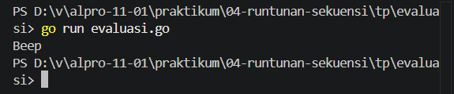
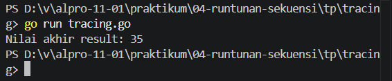
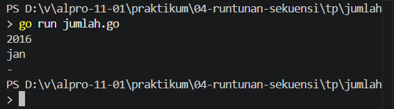

# <h1 align="center">Tugas Pendahuluan Modul [4] - [RUNTUNAN/SEKUENSI]</h1>

[Varel Dwi Putra] - [109092600024]

### 1. Evaluasi Ekspresi Kontrol Dalam GO

package main

import "fmt"

func main() {
	intNum := 5
	intOther := 10
	//var sngNum float64 = -3

	if intNum >= 5 && intOther < 11 {
		fmt.Println("Beep")
	}

}

##### Output

1. false
intNum > 5
2. true
intNum >= 5 && intOther < 11
3. true
sngNum != -1 || intOther < 0
4. true
!(intNum > 3) || intNum <= 5
5. false
!(intOther >= intNum)
6. false
0 - sngNum > 0
7. true
4 / 2 == intOther / intNum
8. true
intOther % 2 == 0
9. true
intOther + 2 * intNum != 30 || !(sngNum > 0)
10. true
intOther > 0 && intNum > 0 || sngNum > 0
11. true
sngNum > 0 || (intNum >= 0 && -1 * intOther == -10)
12. true
intNum == 5
13. true
intNum > 0 || (sngNum <= 0 && intOther == 13)
14. true
!(!(!(!(intNum > 0))))

#### Deskripsi
Latihan mengevaluasi logika dasar pada kondisi if dengan variabel intNum = 5, intOther = 10, dan sngNum = -3. Kita diminta menentukan apakah 14 ekspresi logika yang diberikan bernilai true atau false.

### 2. Tracing Evaluasi Pernyataan Kondisi

package main

import "fmt"

func main() {
	x := 10
	y := 5
	z := 15
	result := 0

	if x > 5 {
		if y < 10 {
			result = x + y
		} else {
			result = x - y
		}
	}

	if z > 10 && x == 10 {
		result += z
	} else {
		result = z - x
	}

	if x == 10 || y > 10 {
		result += 5
	} else if y == 5 && z > 10 {
		result -= 5
	} else {
		result *= 2
	}

	if !(x < 15 && y < 10) {
		result += 10
	} else {
		_ = result - 10
	}

	fmt.Println("Nilai akhir result:", result)
}

##### Output

​1. Nilai akhir variabel result: 35

​2. Output program: Nilai akhir result: 35

​3. Penjelasan Singkat (Tracing):

​ -Kondisi 1: 10 > 5 (true) dan 5 < 10 (true) \rightarrow result = 10 + 5 = 15.

​ -Kondisi 2: 15 > 10 \text{ \&\& } 10 == 10 (true) \rightarrow result = 15 + 15 = 30.

​ -Kondisi 3: 10 == 10 \text{ \vert{}\vert{} } 5 > 10 (true) \rightarrow result = 30 + 5 = 35.

​ -Kondisi 4: !(10 < 15 && 5 < 10) \rightarrow !(true) = false. Masuk ke else yang berisi result - 10. Karena tidak ada tanda sama dengan (-=), nilainya tidak tersimpan dan result tetap 35.

#### Deskripsi
 melacak alur eksekusi program dan menentukan nilai akhir dari setiap variabel setelah program selesai dijalankan.

 ### 3. Menentukan Jumlah Hari Dalam Sebulan Berdasarkan Tahun Dan Bulan

package main

import "fmt"

func main() {
	var tahun int
	var bulan string

	fmt.Scan(&tahun, &bulan)

	// Pengecekan nama bulan valid atau tidak
	if bulan == "Jan" || bulan == "Mar" || bulan == "Mei" || bulan == "Jul" || bulan == "Agu" || bulan == "Okt" || bulan == "Des" {
		fmt.Println(31)
	} else if bulan == "Apr" || bulan == "Jun" || bulan == "Sep" || bulan == "Nov" {
		fmt.Println(30)
	} else if bulan == "Feb" {
		// Pengecekan tahun kabisat untuk bulan Februari
		if (tahun%400 == 0) || (tahun%4 == 0 && tahun%100 != 0) {
			fmt.Println(29)
		} else {
			fmt.Println(28)
		}
	} else {
		// Jika nama bulan tidak sesuai format/kapitalisasi (misal: "jan")
		fmt.Println("-")
	}
}

##### Output

#### Deskripsi
Program yang meminta input berupa tahun dan tiga huruf pertama dari nama bulan (dengan huruf pertama kapital) dari pengguna. Program kemudian menampilkan jumlah hari dalam bulan tersebut.

### 4. Switch Case

package main

import "fmt"

func main() {
	var hari int
	fmt.Print("Masukkan angka hari (1-7): ")
	fmt.Scan(&hari)

	switch hari {
	case 1:
		fmt.Println("Senin")
	case 2:
		fmt.Println("Selasa")
	case 3:
		fmt.Println("Rabu")
	case 4:
		fmt.Println("Kamis")
	case 5:
		fmt.Println("Jumat")
	case 6:
		fmt.Println("Sabtu")
	case 7:
		fmt.Println("Minggu")
	default:
		fmt.Println("Input tidak valid! Masukkan angka 1 sampai 7.")
	}
}

##### Output

#### Deskripsi
Pembuatan contoh kode program sederhana menggunakan struktur kontrol switch case dalam bahasa Go.

## Kesimpulan
Tugas pendahuluan praktikum Algoritma Pemrograman yang berfokus pada pemahaman dan penerapan struktur kontrol keputusan (if-else dan switch-case) serta logika ekspresi boolean dalam bahasa pemrograman Go.
